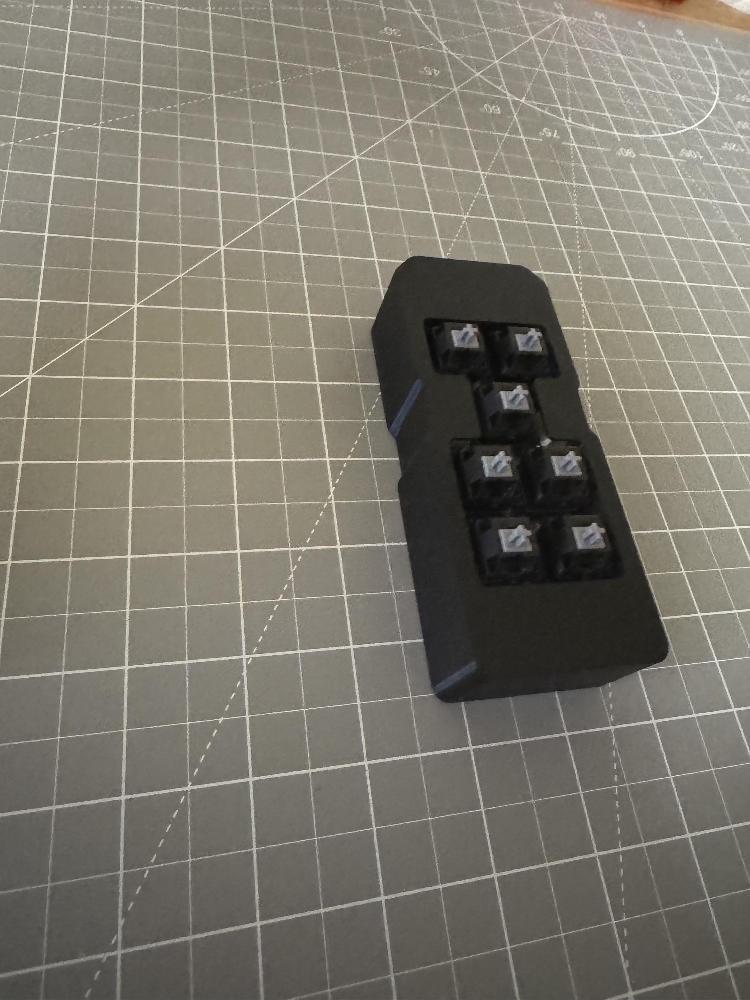

# bed-controller-controller

This controls a Richmat HJH89 remote control that came with my bed but should work for any remote.

It has 3 memory buttons that are controlled by the ESP32-C6 controller (zg (zero-g), sit-up (memory) & flat)

I didn't include the massage buttons, underbed light, lumbar or head tilt as I never used them.

The switchs controlling the Head Up/Down & Feet Up/Down are not controllable from the ESP as the delay made it hard to actually get it to a possition you want.

## Parts List

1x [Bed Remote](https://svenandson.com/products/sven-son-replacement-remote?variant=32488578908238)
3x [Relays](https://www.digikey.com/en/products/detail/te-connectivity-potter-brumfield-relays/1462041-7/2126941)
3x [Transistors](https://www.digikey.com/en/products/detail/diodes-incorporated/MMBT3904-7-F/814494)
1x [Seeed Studio XIAO ESP32-C6](https://www.seeedstudio.com/Seeed-Studio-XIAO-ESP32C6-p-5884.html)
7x Cherry-MX Keyswitches
7x relegendable keycaps (the ones pictures were random purchase from amazon, trying laser engraving blank black keycaps when I can)
1x 2-pin picoblade inline male (power cable)
1x 2-pin picoblade inline female (power cable)
1x 6-pin picoblade inline male
1x 6-pin picoblade inline female
1x 8-pin picoblade inline male
1x 8-pin picoblade inline female

### Notes

- it doesn't matter which set of pins are connected with the 6 or 8 pin, just make sure you wire them to the correct contacts on the OEM remote.
- For my OEM Remote PCB I rounded the corners of the PCB with sandpaper, needed within the provided case but no real functional reason.

## Pictures along the way

Board with all parts soldered on.

### Top of board with components soldered in place

### Bottom of board with components & wires soldered in place along with OEM remote

### PCBs placed inside the case

The foam block is a cube from [this sheet](https://www.mcmaster.com/catalog/131/4104/3157T23). It keeps the OEM PCB in place as there's no good place to put a screw through that PCB.

### Completed Assembly

Don't know how I got so lucky on the clearances but my print of the case stays together well but is easy enough to take back apart.